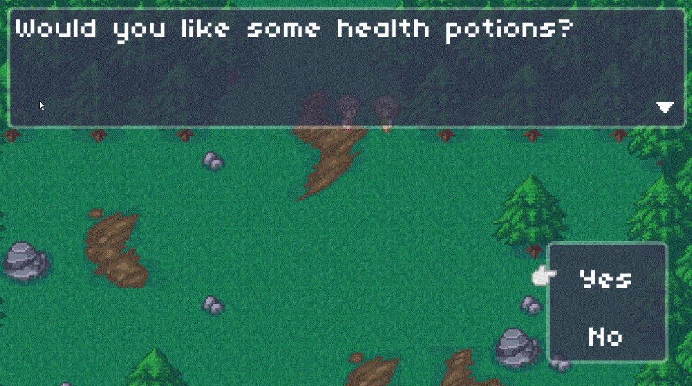

# MyRPGPrototype

ART CREDITS: \
Top-down town and forest artwork, in addition to music, created by: Luis Zuno (@ansimuz) from https://ansimuz.itch.io/ \
Combat entity sprites created by: LuizMelo from https://luizmelo.itch.io/ \
Combat background art created by: Author: Nidhoggn from https://opengameart.org/users/nidhoggn \
Character sprites in the overworld created by: Pipoya from https://pipoya.itch.io/ 

# Overview
As the title of this repo suggests, this code establishes the foundation of a jrpg-style video game. This project is
coded completely in Lua with the LOVE2D game development framework. If someone wants to run this code, they must 
install LOVE2D.

I created this project in order to experiment with the challenging algorithms and design issues that come along with
video game programming. The goal of this project wasn't to create an original or entertaining game. Rather, I just
wanted to improve my programming skills.

Here's a summary of some notable features in the game:
- The player can move around a 2-D world.
- The player can press 'Enter' to start dialogue with an npc (this may include questions and responses).
- The player can press 'Enter" while next to a doorway/passage to transition to a different area within the game.
- The game area below the starting area has a chance to trigger a combat state when the player is walking. The combat state is stacked on top of the current state; 
  so when combat ends, the combat state is popped, and the player is in the same state they were in before combat began.
- Combat is turn-based, supporting two player-side entities and 1-4 enemy-side entities. Currently, combat is basic, with
entities only having a single attack, and damage calculations are simple and not left to chance.

Example of an attack in combat. (This gif may take a moment to load):

Example of question-and-answer dialogue:

